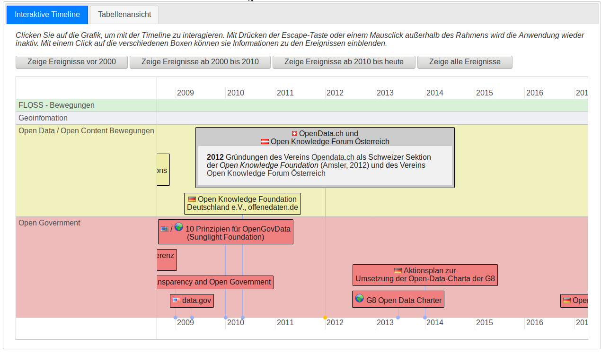

# Open Data Timeline
Wesentliche Ereignisse im Zusammenhang mit Open Data und angrenzenden Themen sind hier in einer interaktiven Timeline zusammengefasst. Sie ist Teil der  [Vorlesung Open Data](https://www.opengeoedu.de/learn/opendata/vorlesung) im offenen Onlinekurs OpenGeoEdu.

# Abhängigkeiten

Die Anwendung basiert auf  [vis.js](http://visjs.org/docs/timeline/) und [DataTables](https://datatables.net/). Außerdem werden [jQuery](https://jquery.com/) und [https://jqueryui.com/](jQuery UI), sowie Flaggen-Icons von [FAMFAMFAM](http://www.famfamfam.com) verwendet.
